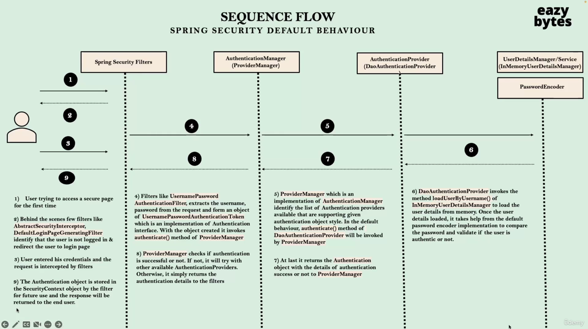

# Learnings.

## Section 1

1. After adding the spring security dependency you api is secured by default.
2. The username is user and the password you can see on the terminal from which you ran the project.
3. Once you use the username and password you will be able to access the api.
4. No need to again try username and password for the next request. (i.e once session of the browser it is valid.)
5. https://docs.spring.io/spring-boot/docs/current/reference/html/application-properties.html
6. Add properties to override the username and password in application.properties.
7. Spring security internal flow
    
8. Debugging
   1. DefaultLoginPageGeneratingFilter ->  generateLoginPageHtml()
   2. Read about AbstractSecurityInterceptor -> finallyInvocation()
   3. UsernamePasswordAuthenticationFilter -> attemptAuthentication()
   4. ProviderManager -> authenticate()
   5. AbstractUserDetailsAuthenticationProvider(DaoAuthenticationProvider) ->authenticate()
   6. InMemoryUserDetailsManager -> loadUserByUsername()
9. Spring security sequence diagram.
   
   1) User trying to access a secure page for the first time.
   2) Behind the scenes few filters like AbstractSecurityInterceptor, DefaultLoginPageGeneratingFilter identify that the user is not logged in & redirect the user to login page.
   3) User entered his credentials and the request is intercepted by filters
   4) Filters like UsernamePasswordAuthenticationFilter, extracts the username, password from the request and form an object of UsernamePasswordAuthenticationToken which is an implementation of Authentication interface. With the object created it invokes authenticate() method of ProviderManager.
   5) ProviderManager which is an implementation of AuthenticationManager identify the list of Authentication providers available that are supporting given authentication object style. In the default behaviour, authenticate() method of DaoAuthenticationProvider will be invoked by ProviderManager
   6) DaoAuthenticationProvider invokes the method loadUserByUsername() of InMemoryUserDetailsManager to load the user details from memory. Once the user details loaded, it takes help from the default password encoder implementation to compare the password and validate if the user is authentic or not.
   7) At last, it returns the Authentication object with the details of authentication success or not to ProviderManager
   8) ProviderManager checks if authentication is successful or not. If not, it will try with other available AuthenticationProviders. Otherwise, it simply returns the authentication details to the filters
   9) The Authentication object is stored in the SecurityContext object by the filter for future use and the response will be returned to the end user.
10. Spring security flow chart.
    
11. JSESSIONID used to maintain multiple request of the user.

## Section 2

1. By default Spring security framework protects all the paths present inside the web application.This behaviour is due to code present inside the method defaultSecurityFilterChain(HttpSecurity http) of class SpringBootWebSecurityConfiguration 
   ```text
   @Bean
   @Order(SecurityProperties.BASIC_AUTH_ORDER)
   SecurityFilterChain defaultSecurityFilterChain(HttpSecurity http) throws Exception {
      http.authorizeRequests().anyRequest().authenticated();
      http.formLogin();
      http.httpBasic();
      return http.build();
   }
   ```
2. The class WebSecurityConfigurerAdapter -> configure(HttpSecurity http) is deprecated so do not use. 
3. We can secure the web application API's, path as per our custom requirements using Spring Security framework like below.
   ```text
   @Bean
   @Order(SecurityProperties.BASIC_AUTH_ORDER)
   SecurityFilterChain defaultSecurityFilterChain(HttpSecurity http) throws Exception {
           http.authorizeHttpRequests()
                .antMatchers("/api/v1/my-account", "/api/v1/my-balance", "/api/v1/my-loans", "/api/v1/my-cards")
                .authenticated()
                .antMatchers("/notices", "/contact")
                .permitAll()
                .and().httpBasic()
                .and().formLogin();
        return http.build();
   }
   ```
4. To logout of the session use the `http://localhost:8080/logout`
5. If you want to deny all the request \
   `Note :- Not for production.`
   ```text
   @Bean
   @Order(SecurityProperties.BASIC_AUTH_ORDER)
   SecurityFilterChain defaultSecurityFilterChain(HttpSecurity http) throws Exception {
           http.authorizeHttpRequests()
                .antRequests().denyAll()
                .and().httpBasic()
                .and().formLogin();
        return http.build();
   }
   ```
6. We can permit all the requests coming towards our web application API's, Paths using Spring Security framework like shown below
   `Note :- Not for test/dev environmnet.`
   ```text
   @Bean 
   @Order(SecurityProperties.BASIC_AUTH_ORDER)
   SecurityFilterChain defaultSecurityFilterChain(HttpSecurity http) throws Exception {
           http.authorizeHttpRequests()
                .antRequests().permitAll()
                .and().httpBasic()
                .and().formLogin();
        return http.build();
   }
   ```

## Section 3
1. Instead of defining a single user inside application.properties as a next step we can define multiple users along with their authorities with help of InMemoryDetailsManger & User Details
   1. Approach 1 where we use withDefaultPasswordEncoder() method while creating the user details
        ```text
        @Bean
        public InMemoryUserDetailsManager userDetailsService() {
            /**
            * Approach 1 where we use withDefaultPasswordEncoder() method
            * while creating the user details
            */
            UserDetails admin = User.withDefaultPasswordEncoder()
                                .username("admin")
                                .password("12345")
                               .authorities("admin")
                               .build();
            UserDetails user = User.withDefaultPasswordEncoder()
                                .username("user")
                                .password("12345")
                                .authorities("read")
                               .build();
        return new InMemoryUserDetailsManager(admin, user);
        }
        ```
      1. We need User object which requires a password encoder and role.
   2. Where we don't define password encoder while creating the user details.Instead, a separate PasswordEncoder bean will be created 
      ```text 
         @Bean
         public InMemoryUserDetailsManager userDetailsService() {
            /**
            * Approach 2 where we don't define password encoder
            * while creating the user details. Instead a separate
            * PasswordEncoder bean will be created.
            */
            InMemoryUserDetailsManager userDetailsService = new InMemoryUserDetailsManager();
            UserDetails admin = User.withUsername("admin").password("12345").authorities("admin").build();
            UserDetails user = User.withUsername("user").password("12345").authorities("read").build();
            userDetailsService.createUser(admin);
            userDetailsService.createUser(user);
            return userDetailsService; 
         }
      
         @Bean
         public PasswordEncoder passwordEncoder() {
            return NoOpPasswordEncoder.getInstance();
         }
         ```
2. User Management important classes and interfaces.
   
3. org.springframework.security.core.userdetails.UserDetails.java \
   Has all the functions
4. What is the significance of Authentication object and UserDetails
   
5. org.springframework.security.core.Authentication
6. javax.security.auth.Subject.Principal.
7. UserDetailsService -> loadUserByUsername()
8. UserDetailsManager extends UserDetailsService
9. Add the ldap dependency.
10. UserDetailsManager implementations. 
    1. InMemoryUserDetailsManager 
    2. JdbcUserDetailsManager -> Connection with database
    3. LdapUserDetailsManager ->


# Reading and explorations.
1. Do read about JSESSIONID how and when it gets created and destroyed, what is the significance when to use it.
2. Read about servlets and filters.
3. Read about spring security filters (approx 25 filters). 
4. What are the default authorities.
5. 

# Links
1. https://www.baeldung.com/spring-security-registered-filters#:~:text=Important%20Spring%20Security%20Filters&text=AnonymousAuthenticationFilter%3A%20when%20there's%20no%20authentication,ExceptionTranslationFilter%3A%20catch%20Spring%20Security%20exceptions
2. https://stackoverflow.com/questions/10140515/spring-security-where-can-i-find-the-list-of-all-security-filters-registered-w
3. https://docs.spring.io/spring-security/site/docs/3.1.4.RELEASE/reference/security-filter-chain.html
4. https://www.javadevjournal.com/spring-security/spring-security-filters/
5. https://ckinan.com/blog/spring-security-filter-chain/
6. https://visweshwar.medium.com/debugging-a-custom-spring-security-filterchain-3a2ea3f5ee38
7. https://docs.spring.io/spring-security/site/docs/5.2.11.RELEASE/reference/html/authorization.html
8. 